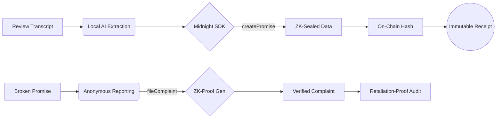

# 🛡️ ProofWork — Workplace Truth, Shielded by Zero-Knowledge

> **Harnessing Midnight ZKP for a more ethical and transparent workspace. Capture the promises that matter.**

<div align="center">

[](https://www.loom.com/share/841dce01bdbb496b81cdb5f97d497630)
[](https://www.slideshare.net/slideshow/proofwork-workplace-truth-shielded-by-zero-knowledge-pptx/286955219)
[](https://midnight.network)
[](https://docs.midnight.network)

</div>

---

## 🚩 The Problem
In modern workplaces, critical promises made during performance reviews or private meetings are often **"lost in translation"** or conveniently forgotten.
- **Retaliation**: Employees fear reporting broken promises due to a lack of anonymity.
- **Accountability Gap**: Managers can retract verbal commitments without any audit trail.
- **Privacy vs. Proof**: Proving a promise existed usually requires sacrificing the privacy of the entire conversation.

## 💡 The Solution: ProofWork
ProofWork is a **Zero-Knowledge Evidence Layer** that allows employees to cryptographically seal specific professional promises on-chain without exposing the underlying data.

- **Selective Disclosure**: Only the fact that a promise was made is on-chain; the content remains 100% private.
- **Retaliation-Proof Reporting**: Use ZK-Proofs to file complaints anonymously, proving you are a verified employee without revealing your identity.
- **Immutability**: Once a promise is sealed via Midnight, it cannot be tampered with or "un-said".

---

## ✨ Features that Empower

### 🧠 Smart Capture
Client-side AI analyzed meeting transcripts to extract commitments like salary raises, promotions, or budget approvals instantly.

### 🔐 ZK-Vault
Seals your promises into the Midnight Network using the `createPromise` circuit. You receive a cryptographic receipt that only you can see.

### 🕵️ Anonymous Whistleblower
File a complaint against a manager by generating a ZK-Proof of your "Sealed Promise". HR/The Board receives verified evidence without knowing who you are.

---

## 🎮 Live Demo Guide

To experience the power of **Selective Disclosure**, copy-paste this into the dApp:

> "I've reviewed your performance for Q3. You've exceeded all KPIs, and as discussed, I am promising you a 15% salary increment starting from September 30, 2025. This is contingent on you maintaining the same level of leadership in the engineering team."

**Extraction Results:**
- ✅ **Promise**: 15% Salary Increment
- ✅ **Deadline**: September 30, 2025
- ✅ **Condition**: Maintaining leadership level

---

## 🏗️ Architecture Flow



---

## ⚙️ Installation & Setup

### 1. Repository Setup
Clone the repository and install dependencies:
```bash
git clone https://github.com/Shantanu112-bd/midnight-hackathon-
cd proofwork
npm install
```

### 2. Configure Environment
Create a `.env` file in the root directory:
```bash
# Optional: For AI-powered promise extraction
ANTHROPIC_API_KEY=sk-ant-xxx

# Required: API & Mock settings
VITE_API_URL=http://localhost:3001
MOCK_MODE=false
```

### 3. Start Proof Server (Docker)
Midnight applications require a proof server to generate ZK proofs locally. Run this in a separate terminal:
```bash
docker run -p 6300:6300 midnightntwrk/proof-server:latest midnight-proof-server -v
```

### 4. Wallet Configuration (Lace)
1. Install the [Lace Wallet Extension](https://www.lace.io/) (Midnight Beta version).
2. Enable **Beta Features** in Settings.
3. Switch to **Developer Mode**.
4. Set the **Proof Server URL** to `http://localhost:6300`.
5. Ensure you have testnet tokens (visit the Midnight Faucet).

### 5. Launch the Application
```bash
# Start backend API (optional if using local demo mode)
# npm run api

# Start frontend development server
npm run dev
```

---

## 📽️ Final Walkthrough
[**Watch the Loom Demo Video**](https://www.loom.com/share/841dce01bdbb496b81cdb5f97d497630)

---

> Built with ❤️ for the Midnight Hackathon. **Empowering the individual with Zero-Knowledge.**